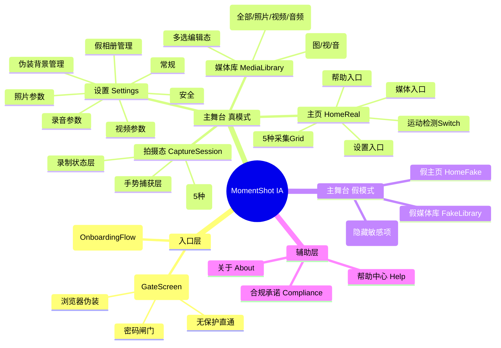
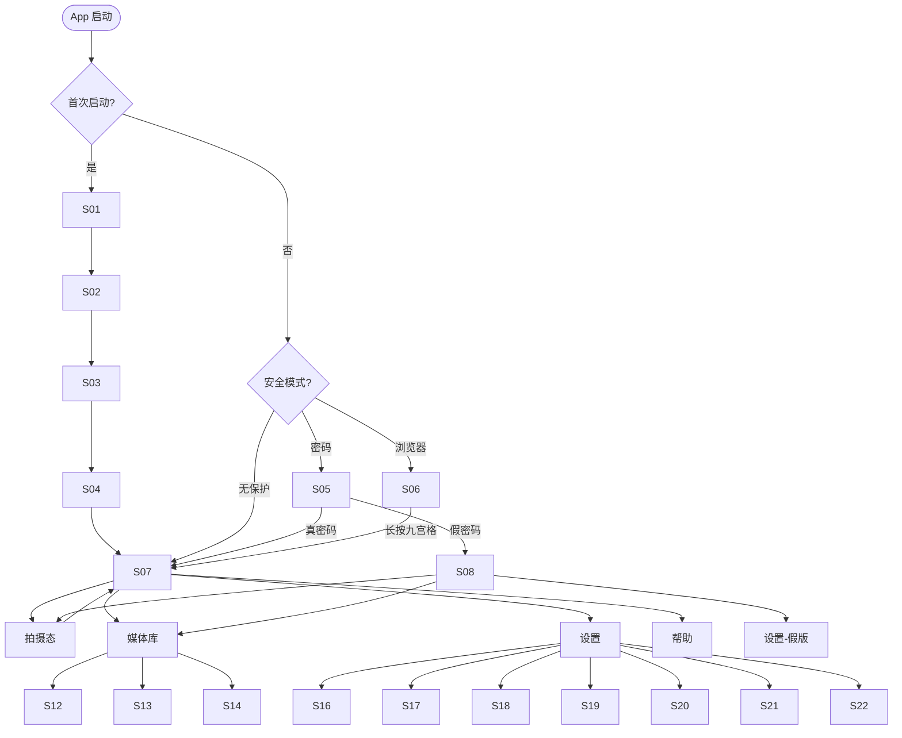
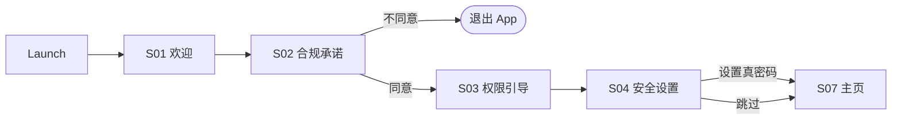
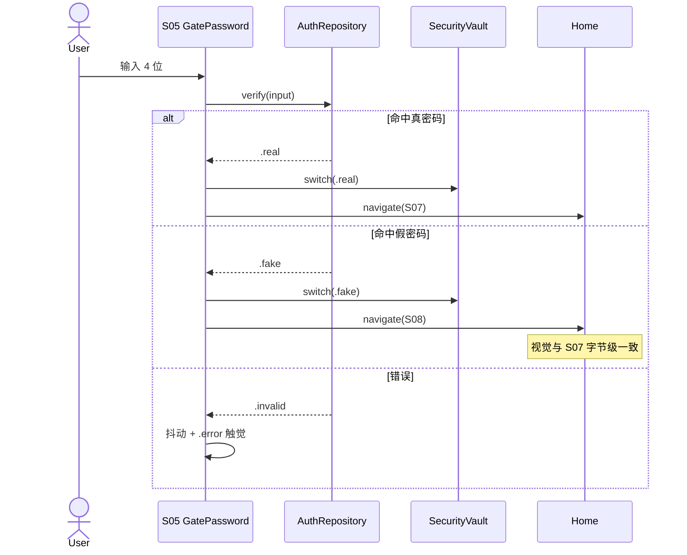
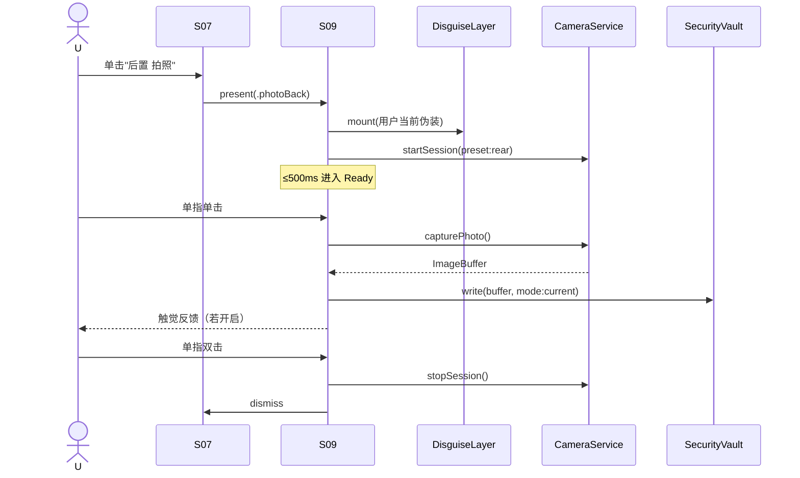
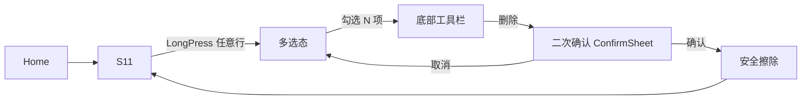
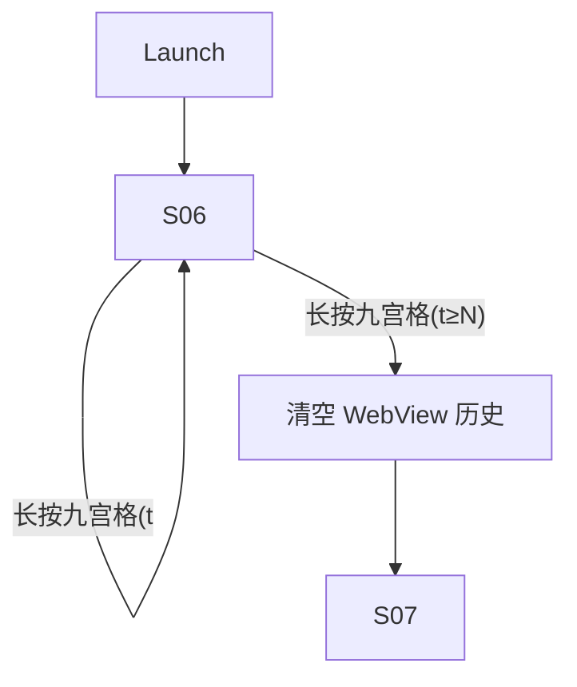
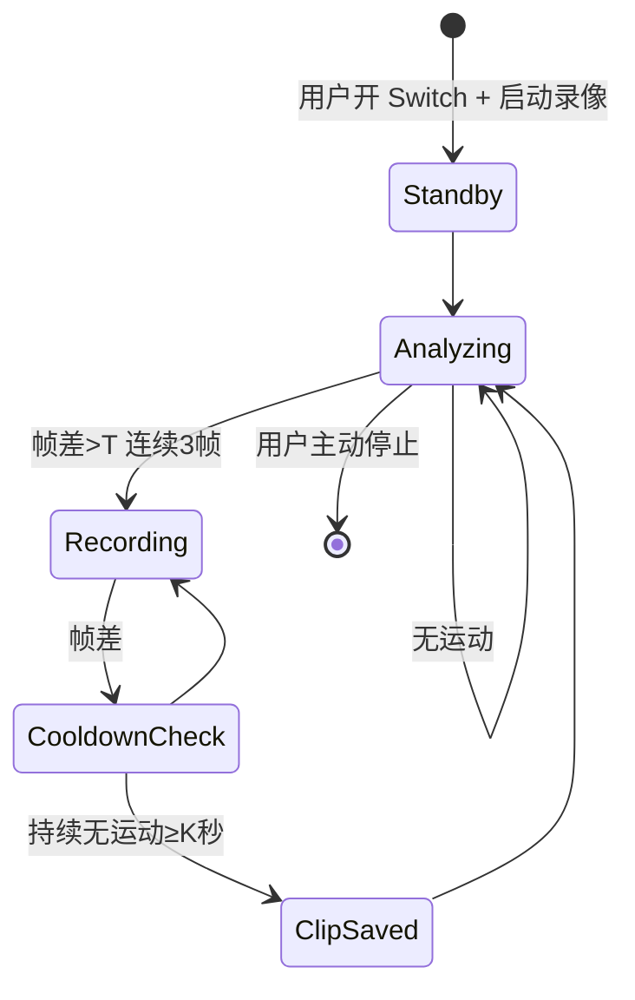

# MomentShot · UX 设计与 AI 自动化编程指引（UX_DESIGN）

> 面向 AI Agent 分步骤、可验收交付的"页面 × 组件 × 流程 × 交互"完整设计书

| 项目     | 信息                                                                 |
| -------- | -------------------------------------------------------------------- |
| 文档名称 | MomentShot UX Design & AI Build Plan                                    |
| 文档版本 | v1.0                                                                 |
| 适用对象 | AI 编程 Agent / 设计 / 前端 / QA                                     |
| 最后更新 | 2026-04-25                                                           |

---

## 目录

- [0. 设计哲学与原则](#0-设计哲学与原则)
- [1. 信息架构（IA）与导航地图](#1-信息架构ia与导航地图)
- [2. 页面（Screen）总览与路由表](#2-页面screen总览与路由表)
- [3. 设计系统（Design Tokens & 组件库）](#3-设计系统design-tokens--组件库)
- [4. 全局交互规则与手势字典](#4-全局交互规则与手势字典)
- [5. 详细页面设计](#5-详细页面设计)
- [6. 关键用户流程图（End-to-End Flows）](#6-关键用户流程图end-to-end-flows)
- [7. 隐蔽拍摄伪装设计（含 Loading / 2048 创意伪装）](#7-隐蔽拍摄伪装设计含-loading--2048-创意伪装)
- [8. 状态设计（Empty / Loading / Error / Success）](#8-状态设计empty--loading--error--success)
- [9. 文案系统（Microcopy）](#9-文案系统microcopy)
- [10. 可访问性 / 隐私 / 防泄露 UX 规则](#10-可访问性--隐私--防泄露-ux-规则)
- [11. AI 分步开发任务包（Sprint Plan）](#11-ai-分步开发任务包sprint-plan)
- [12. 通用验收清单（DoD Checklist）](#12-通用验收清单dod-checklist)
- [13. 附录：组件命名约定 / 文件目录建议](#13-附录组件命名约定--文件目录建议)

---

## 0. 设计哲学与原则

### 0.1 一句话 UX 定位

> **"看似什么都没在用 → 实则一切尽在掌握"**：每一个 UI 决策都为"少暴露 / 防胁迫 / 零误触 / 单手可触达"服务。

### 0.2 5 条核心 UX 原则

| 编号 | 原则                | 决策准绳                                                                                  |
| ---- | ------------------- | ----------------------------------------------------------------------------------------- |
| P1   | 隐蔽优先            | 任何 UI 默认值都偏"少暴露"；不要图标动画 / 不要无意义提示音 / 不要弹窗炫技               |
| P2   | 单手 1s 可触达       | 主页 5 种采集模式必须"瞄一眼就能按到"，按键面积 ≥ 64×64pt，热区扩到 88×88pt              |
| P3   | 双闸防误触          | "退出拍摄态 / 删除内容 / 关闭录音提示音"等高风险操作 = 双击 OR 二次确认                   |
| P4   | 防胁迫合理推诿       | 真 / 假视觉与流程必须**不可区分**；对外不出现"MomentShot / 隐蔽 / 取证"等敏感字眼          |
| P5   | 全局暗黑            | 深蓝暗黑底 + 单一品牌色（雾蓝 #5E7A8C），弱光不刺眼、夜间使用更不易被察觉                |

### 0.3 设计反模式（绝对禁止）

- 拍摄成功的"咔嚓声 / 闪光动画 / Toast 提示" → 暴露
- "您正在使用隐蔽相机" 这类文案 → 法律 + 用户安全双重风险
- 假相册中显示"假相册"任何字样或图标 → 破坏可推诿性
- 在多任务卡片中露出真主页快照 → 必须在 `applicationWillResignActive` 时切到伪装层

---

## 1. 信息架构（IA）与导航地图

### 1.1 顶层 IA（按用户心智重新分组）



### 1.2 导航层级（最大深度 4 层）

| 层级 | 示例                                                          |
| ---- | ------------------------------------------------------------- |
| L0   | 启动闸门（密码 / 浏览器）                                       |
| L1   | 主页（真 / 假）                                                |
| L2   | 拍摄态 / 媒体库 / 设置 / 帮助                                   |
| L3   | 媒体预览 / 设置子页 / 伪装编辑 / 假相册管理                     |
| L4   | 帮助说明气泡（Modal，不算页面跳转）                            |

> 原则：**任何核心采集动作距离 L0 不超过 2 跳**（启动 → 主页 → 拍摄态）。

### 1.3 入口策略矩阵

| 入口动作                        | 触达成本 | 隐蔽等级 | 适用场景                |
| ------------------------------- | -------- | -------- | ----------------------- |
| 直接点 App 图标 → 主页（无保护）| 极低     | 低       | 信任环境（家中）        |
| 输入真密码 → 主页                | 低       | 中       | 日常默认                |
| 输入假密码 → 假主页              | 低       | 高       | 被胁迫场景              |
| 浏览器伪装 → 长按九宫格 → 主页   | 中       | 极高     | 公共场所 / 高敏感       |
| 主页 → 长按某个采集卡 → 拍摄态   | 极低     | 中       | 需要立即开拍            |

---

## 2. 页面（Screen）总览与路由表

> 共 **22 个独立页面 + 6 个 Modal/Sheet 组件**。  
> 路由命名遵循 SwiftUI NavigationStack `path` 风格：`/section/sub`。

### 2.1 页面清单

| #  | Screen ID                | 中文名               | 模块         | 路由                          | 优先级 |
| -- | ------------------------ | -------------------- | ------------ | ----------------------------- | ------ |
| S01| `OnboardingWelcome`      | 首启欢迎             | Onboarding   | `/onboarding/welcome`         | P0     |
| S02| `OnboardingCompliance`   | 使用承诺（必读）     | Onboarding   | `/onboarding/compliance`      | P0     |
| S03| `OnboardingPermissions`  | 权限申请引导         | Onboarding   | `/onboarding/permissions`     | P0     |
| S04| `OnboardingSecuritySetup`| 首次安全设置（可跳过）| Onboarding   | `/onboarding/security`        | P0     |
| S05| `GatePassword`           | 启动密码闸门         | Gate         | `/gate/password`              | P0     |
| S06| `GateBrowser`            | 浏览器伪装闸门       | Gate         | `/gate/browser`               | P1     |
| S07| `HomeReal`               | 真主页（采集中枢）   | Home         | `/home`                       | P0     |
| S08| `HomeFake`               | 假主页（伪装版）     | Home         | `/home` (mode=fake)           | P0     |
| S09| `CaptureSession`         | 拍摄态（5 种伪装）   | Capture      | `/capture?mode=…`             | P0     |
| S10| `CaptureRecording`       | 录像 / 录音中状态层  | Capture      | (S09 子状态)                  | P0     |
| S11| `MediaLibrary`           | 媒体管理列表         | Media        | `/media`                      | P0     |
| S12| `MediaPreviewPhoto`      | 照片预览             | Media        | `/media/preview/photo/:id`    | P0     |
| S13| `MediaPreviewVideo`      | 视频播放器           | Media        | `/media/preview/video/:id`    | P0     |
| S14| `MediaPreviewAudio`      | 音频播放器           | Media        | `/media/preview/audio/:id`    | P0     |
| S15| `SettingsRoot`           | 设置首页             | Settings     | `/settings`                   | P0     |
| S16| `SettingsGeneral`        | 常规                 | Settings     | `/settings/general`           | P0     |
| S17| `SettingsSecurity`       | 安全                 | Settings     | `/settings/security`          | P0     |
| S18| `SettingsPhoto`          | 照片参数             | Settings     | `/settings/photo`             | P1     |
| S19| `SettingsAudio`          | 录音参数             | Settings     | `/settings/audio`             | P1     |
| S20| `SettingsVideo`          | 视频参数             | Settings     | `/settings/video`             | P1     |
| S21| `SettingsDisguise`       | 伪装背景管理         | Settings     | `/settings/disguise`          | P1     |
| S22| `SettingsFakeAlbum`      | 假相册管理           | Settings     | `/settings/fake-album`        | P0     |
| S23| `HelpCenter`             | 帮助中心             | Help         | `/help`                       | P1     |

### 2.2 复用组件 / Modal 清单

| ID    | 名称              | 用途                                          |
| ----- | ----------------- | --------------------------------------------- |
| M01   | `HelpDialog`      | 设置项右侧 ❓ 弹气泡说明                       |
| M02   | `ConfirmSheet`    | 二次确认（删除 / 关闭录音提示音 / 重置）       |
| M03   | `Toast`           | 极短轻提示（仅非敏感场景使用）                 |
| M04   | `MutexAlert`      | 互斥规则提示（如密码 vs 浏览器伪装）           |
| M05   | `QuotaAlert`      | 存储不足 / 超出上限 提示                      |
| M06   | `PermissionGuide` | 权限被拒后跳系统设置的引导卡                   |

### 2.3 路由跳转关系图



---

## 3. 设计系统（Design Tokens & 组件库）

### 3.1 颜色 Token（Dark Theme · 默认）

| Token              | HEX        | 用途                              |
| ------------------ | ---------- | --------------------------------- |
| `color.bg.primary` | `#0F172A`  | 全局背景（Neutral）               |
| `color.bg.elevated`| `#1A202C`  | 卡片 / Sheet（Tertiary）          |
| `color.bg.divider` | `#2D3748`  | 1px 分割线（Secondary）           |
| `color.brand`      | `#5E7A8C`  | 主品牌色（Primary 雾蓝）          |
| `color.brand.dim`  | `#4C6576`  | 品牌色降饱和（约 80%）            |
| `color.text.primary`| `#E6EDF6` | 主文字                            |
| `color.text.secondary`| `#A9B6C8`| 次文字                          |
| `color.text.disabled`| `#6F7D91`| 禁用文字                         |
| `color.danger`     | `#FF453A`  | 删除 / 录制红点 / 错误            |
| `color.warning`    | `#FFD60A`  | 互斥提示 / 配额警告               |
| `color.success`    | `#30D158`  | 极少使用，仅 Toast 成功态         |

> Light Theme：仅作为可选项预留，首版默认强制 Dark；切换不写入「外观偏好」系统设置。

### 3.2 排版 Token

| Token         | Size / Weight       | 用途                          |
| ------------- | ------------------- | ----------------------------- |
| `type.display`| 56 / Light          | 锁屏时钟伪装的时间            |
| `type.title1` | 28 / Semibold       | 主页大标题                    |
| `type.title2` | 22 / Semibold       | 设置页 section 标题           |
| `type.body`   | 17 / Regular        | 正文 / 列表项主文字           |
| `type.caption`| 13 / Regular        | 辅助文字 / 文件名 hash        |
| `type.mono`   | 14 / Menlo Regular  | 文件名 / 时间戳               |

### 3.3 间距 / 圆角 / 阴影

- 间距系统：`4 / 8 / 12 / 16 / 20 / 24 / 32 / 48` pt
- 圆角：组件 `12pt`、Sheet `20pt`、按钮 `999pt`（pill）
- 阴影：暗黑主题不使用 shadow，只用 `border 1px @ #2D3748` 来分层
- 安全区：所有页面遵守 iOS Safe Area；底部留 24pt 防 Home Indicator 覆盖

### 3.4 通用组件库

| 组件名称            | 描述                                                | 复用页面                |
| ------------------- | --------------------------------------------------- | ----------------------- |
| `BrandLogoMark`     | 雾蓝"DC"字符 + 摄像头标志                           | Onboarding / Help       |
| `PinPad`            | 4 位数字密码输入键盘（10 键 + 退格）                | S05 / 设置              |
| `CaptureCard`       | 主页采集卡（前/后置 × 拍照/录像、录音）             | S07 / S08               |
| `ToggleRow`         | 设置项标准行：标题 + 描述 + Switch + ❓             | S15-S22                 |
| `SegmentTab`        | 媒体库底部 Tab（全部/照片/视频/音频）               | S11                     |
| `MediaListItem`     | 媒体列表行：缩略图 + 时间 + 大小 + 文件名 + ⬇      | S11                     |
| `DisguiseLayer`     | 伪装层抽象容器（Original/Dim/Clock/Custom/Loading/2048）| S09                 |
| `GestureCatcher`    | 全屏透明手势采集层                                  | S09                     |
| `RecIndicator`      | 红色录制点（8×8pt + 闪烁动画）                      | S09                     |
| `HelpDialog`        | M01 标准说明弹窗                                    | 全设置页                |
| `EmptyState`        | "没有找到媒体文件" 居中文字                         | S11                     |

---

## 4. 全局交互规则与手势字典

### 4.1 全局手势（拍摄态以外）

| 手势               | 行为                                  | 备注                       |
| ------------------ | ------------------------------------- | -------------------------- |
| 单击               | 选中 / 进入                           |                            |
| 长按列表项 ≥ 0.5s  | 进入多选态（仅媒体库）                |                            |
| 滑动返回           | 系统级 Push 页面支持                  | 设置子页                   |
| 双指捏合           | 仅在媒体预览页用于缩放图片            |                            |

### 4.2 拍摄态手势字典（核心）

| 手势                | 拍照模式                   | 录像模式                          | 录音模式               |
| ------------------- | -------------------------- | --------------------------------- | ---------------------- |
| 单指单击            | 拍一张                     | （默认）开始 / 停止录制           | 开始 / 停止            |
| 单指双击            | **退出拍摄态**             | **退出拍摄态（录制中先停再退）** | **退出（先停再退）**   |
| 单指左滑 / 右滑     | 切换上一/下一伪装背景      | 同左                              | 同左                   |
| 双指 / 三指单击     | （未启用）                 | 若设置选择 2/3 指 → 录制开/停       | -                      |
| 摇晃手机 ≥3 次      | （P2）紧急清空二次确认     | 同左                              | 同左                   |

### 4.3 防误触规则

- 单击与双击通过 `tap.require(toFail: doubleTap)` 解耦
- 两次连续拍照间隔 < 200ms → 丢弃
- 退出拍摄态触发后立即 disable 所有手势 300ms，避免连击穿透到主页
- 录制中检测到来电 / 锁屏 → **先落盘已录片段，再退出拍摄态**

### 4.4 触觉反馈表

| 场景                 | 类型                       | 受设置控制         |
| -------------------- | -------------------------- | ------------------ |
| 拍照成功             | `.light`                   | 受「拍照振动」设置控制 |
| 录像开始 / 停止      | `.medium`                  | 受「摄像振动」设置控制 |
| 录音开始 / 停止      | `.medium`                  | （强制）           |
| 长按解锁达到时长      | `.success`                 | -                  |
| 互斥 / 错误          | `.error`                   | -                  |
| 进入多选态           | `.selection`               | -                  |

---

## 5. 详细页面设计

> 每页结构：**页面定位 → 进入条件 → 视觉布局 → 组件清单 → 状态机 → 交互细节 → 边界 / 异常**。

---

### S01 · `OnboardingWelcome` 首启欢迎

- **页面定位**：用户对 App 的第一印象，建立"专业 / 安全"心智。
- **进入条件**：`UserDefaults.firstLaunch == true`
- **视觉布局**（自上而下）：
  1. 顶部 `BrandLogoMark`（80pt）
  2. 主标题：「Welcome to MomentShot`type.title1`）
  3. 副标题：「专业取证与个人安全工具」（`type.body`，secondary 色）
  4. 三段卖点 List：① 隐蔽采集 ② 双密码防搜查 ③ 沙盒加密
  5. 底部主按钮：「开始」（pill，brand 色，宽度 frame.maxWidth - 32）
- **状态机**：仅 Idle → Tap "开始" → 进入 S02
- **交互细节**：禁用滑动返回；不可被手势退出
- **边界**：横屏锁定为竖屏

---

### S02 · `OnboardingCompliance` 使用承诺（必读）

- **页面定位**：法务合规护栏 — 用户必须明确承诺合法使用。
- **视觉布局**：
  1. 标题：「使用前必读」
  2. 滚动正文：列出"不偷拍他人 / 录音双方知情 / 自负法律责任"等 5 条
  3. 底部 Checkbox：「我已阅读并承诺合法合规使用」（默认未勾选）
  4. 主按钮：「同意并继续」（未勾选时灰显）
  5. 次按钮：「不同意，退出 App」（灰色 ghost 按钮）
- **状态机**：Unchecked → Checked → "同意" → S03
- **数据落地**：`UserDefaults.complianceAcceptedAt = Date()`

---

### S03 · `OnboardingPermissions` 权限申请引导

- **页面定位**：分屏依次申请相机 / 麦克风 / 相册（可选）。
- **视觉布局**：
  - 大图标 + 一句话解释 + 「授权」按钮
  - 底部「稍后」灰色 ghost
- **状态机**：相机 → 麦克风 → 相册（选填）→ S04
- **边界**：用户拒绝相机 → 进入 App 但禁用所有拍摄；主页所有采集卡灰显并提示"权限被拒，点击查看"

---

### S04 · `OnboardingSecuritySetup` 首次安全设置（可跳过）

- **页面定位**：引导用户**至少**设置真密码（强烈推荐）。
- **视觉布局**：
  - 大文案：「设置启动密码（强烈推荐）」
  - 4 位 `PinPad` 输入区
  - 主按钮：「设置」 / 次按钮：「以后再说」
- **状态机**：输入 4 位 → 再次确认 → 完成 → S07；点"以后再说" → 直接 S07
- **数据落地**：密码哈希进 Keychain（PBKDF2）

---

### S05 · `GatePassword` 启动密码闸门

- **页面定位**：开启密码后每次启动必经。
- **视觉布局**：
  - 顶部留白 25%
  - 4 个圆形空槽（输入数字时填充主品牌色）
  - 下方 `PinPad`（10 键 + 退格）
  - 不显示任何文字提示，杜绝暴露
- **状态机**：
  ```
  Idle → Inputting(1..4 digits) → Verifying
  Verifying → RealHome (S07)        // 命中真密码
            → FakeHome (S08)        // 命中假密码（视觉无差别）
            → Error (shake) → Idle  // 错误，连续错 5 次 → Locked 60s
  ```
- **关键 UX**：真假命中**完全不可区分**——同样的振动、同样的进入动效、同样无任何 toast/alert。

---

### S06 · `GateBrowser` 浏览器伪装闸门

- **页面定位**：让旁人误以为这是普通浏览器。
- **视觉布局**：
  - 全屏 `WKWebView`，加载 `AppSettings.browserURL`
  - 顶部地址栏（可编辑、可前进后退、可刷新）
  - 底部工具栏：◀ ▶ ⌂ 🔖 ⊞（九宫格图标 = 隐藏入口）
- **状态机**：
  ```
  WebViewLoaded → Browsing (用户正常浏览)
  Browsing → IconLongPress(t<N) → 抬起 → 无效果
           → IconLongPress(t≥N) → 触觉成功 → S07
  ```
- **关键 UX**：
  - 长按未达时长抬起 → **无任何提示**（不能让旁人察觉这是入口）
  - 进度环 / 长按动画 → **不可见**（如需视觉反馈仅在 1 像素位置微变化，不可用大圆环）

---

### S07 · `HomeReal` 真主页（采集中枢）

- **页面定位**：5 种采集模式直达 + 媒体 / 设置入口。
- **视觉布局**（精确 6 区）：
  ```
  ┌─────────────────────────────────────┐
  │  [DC LOGO]              [ ⚙ Settings] │ ← 顶栏 56pt
  ├─────────────────────────────────────┤
  │                                     │
  │   ┌─────────┐    ┌─────────┐        │
  │   │ 📷 后置  │    │ 🎥 后置 │        │ ← Capture Grid 2×2
  │   │  拍照   │    │  录像   │        │   每卡 (W-48)/2 × 140pt
  │   └─────────┘    └─────────┘        │
  │   ┌─────────┐    ┌─────────┐        │
  │   │ 📷 前置  │    │ 🎥 前置 │        │
  │   │  拍照   │    │  录像   │        │
  │   └─────────┘    └─────────┘        │
  │                                     │
  │       ┌───────────────┐             │
  │       │  🎙  录   音   │             │ ← 录音卡（横向，宽=Grid 宽）
  │       └───────────────┘             │
  │                                     │
  │  [⚙] 运动检测器(仅限视频)   [ Switch ] │ ← Toggle 行
  │                                     │
  ├─────────────────────────────────────┤
  │     [ 📁 媒体 ]      [ ❓ 帮助 ]     │ ← 底栏 64pt
  └─────────────────────────────────────┘
  ```
- **组件清单**：
  - 5 个 `CaptureCard`（图标 + 文字 + 长按高亮）
  - 1 个 `ToggleRow`（运动检测）
  - 底栏 2 个 `IconButton`（媒体 / 帮助）
- **状态机**：
  ```
  Idle → Tap(CaptureCard) → S09 (mode=…)
       → Tap(MediaIcon)   → S11
       → Tap(SettingsIcon)→ S15
       → Tap(HelpIcon)    → S23
  ```
- **交互细节**：
  - 单击采集卡 = 进入拍摄态（默认伪装：Original）
  - **长按采集卡 ≥ 0.5s** = 直接以"用户预设默认伪装模式"进入拍摄态（快捷模式，让最熟练的用户更快）
  - 运动检测开关：开启时只对"录像"采集卡生效，"拍照 / 录音"卡变 disabled 并显示淡灰
- **边界**：
  - 未授权相机 → 采集卡灰显，点击弹 `PermissionGuide`
  - 假模式（S08）的视觉与本页 100% 一致

---

### S08 · `HomeFake` 假主页

- **页面定位**：假密码登录后进入；视觉与 S07 完全一致；底层数据写入"假相册"。
- **差异**：
  - 设置入口跳到"假版设置"，自动隐藏：启动密码、假密码管理、假相册管理 3 个 section
  - 媒体入口跳到"假相册" Vault
  - **任何 IO 操作走 `SecurityVault.fake` 上下文**
- **关键 UX 不变量**：UI 渲染、动画、文案、振动、加载时间——必须与 S07 字节级一致

---

### S09 · `CaptureSession` 拍摄态（核心）

- **页面定位**：5 种伪装层 + 1 个手势捕获层 + 状态层（录制时显示）。
- **进入参数**：`mode = .photoBack | .photoFront | .videoBack | .videoFront | .audio`
- **图层结构（z-index 由低到高）**：
  ```
  ┌─────────────────────────────────────┐
  │   z=0  AVCaptureVideoPreviewLayer   │ ← 仅 Original 模式可见，其他模式 hidden=true
  │   z=1  DisguiseLayer (5 选 1)       │ ← 黑屏 / 时钟 / 自定义图 / Loading / 2048
  │   z=2  RecIndicator (录制中 + 设置开)│
  │   z=3  GestureCatcher (全屏透明)    │ ← 接管所有手势
  └─────────────────────────────────────┘
  ```
- **状态机**（UX 关注点）：
  ```
  Entering → BackgroundLoading (≤500ms 必须完成) → Ready
  Ready → SingleTap → Capture → Saving → Ready
  Ready → DoubleTap → Exiting → 主页
  Ready → Swipe(L/R) → SwitchDisguise → Ready
  Recording → Tap → StopRecording → Saving → Ready (录像/录音)
  ```
- **进入 / 退出动效**：
  - 进入：黑色 fade-in 200ms（杜绝"刷一下取景画面"暴露）
  - 退出：黑色 fade-out 100ms → 回主页
- **录制状态视觉**：
  - 红点位置：右上 `top:16, trailing:16`，仅 8×8pt
  - 黑屏伪装下 → 不显示红点（隐蔽优先）
  - 时钟伪装下 → 红点同样不显示，仅在锁屏样式中"信号格"位置变更颜色（不易察觉）

---

### S10 · `CaptureRecording` 录像 / 录音子状态层

- **页面定位**：S09 的录制中视觉叠加层。
- **视觉**：
  - 仅在「显示录制标记」开启且当前伪装允许显示时渲染 `RecIndicator`
  - 录音模式下额外渲染极小的"波形条"（4×16pt，颜色 brand.dim），位于右上
- **交互**：与 S09 一致，单击 = 停止

---

### S11 · `MediaLibrary` 媒体管理列表

- **页面定位**：所有内容查看与管理入口。
- **视觉布局**：
  ```
  ┌─────────────────────────────────────┐
  │  ◀  媒体管理              [ 编辑 ]   │ ← NavBar
  ├─────────────────────────────────────┤
  │ [全部] [照片] [视频] [音频]            │ ← SegmentTab 顶部
  ├─────────────────────────────────────┤
  │ ┌──┐ 2026-04-25 17:12   2.3 MB   ⬇ │ ← MediaListItem
  │ │■■│ 063DD9991869.jpeg              │
  │ └──┘                                │
  │ ┌──┐ 2026-04-25 16:50   12.4 MB  ⬇  │
  │ │▶ │ A2C4E81B….mov                  │
  │ └──┘                                │
  │   ...                               │
  └─────────────────────────────────────┘
  ```
- **状态机**：
  ```
  Loading → Loaded → 用户行为
  Loaded → Tap(item)        → S12/S13/S14
        → LongPress(item)   → MultiSelect
        → Tap(Edit)         → MultiSelect
        → Switch Tab        → Loading filtered

  MultiSelect → Tap(item)   → toggle 选中
              → Tap(Delete) → ConfirmSheet → 删除
              → Tap(Export) → ExportSheet  → 导出
              → Tap(Done)   → Loaded
  ```
- **空态**：居中显示「没有找到媒体文件」（`type.body`, secondary 色）
- **多选态视觉**：
  - 每行左侧出现圆形 checkbox（未选/已选）
  - 底部 Tab 收起，替换为"删除 / 导出 / 取消"工具栏
  - NavBar 标题改为「已选择 N 项」
- **导出去向**：照片/视频 → 系统相册；音频 → 文件 App

---

### S12 / S13 / S14 · 媒体预览（图 / 视 / 音）

- **共通**：黑底全屏 + 顶部返回 + 顶部右上"删除"+"导出"两个图标
- **S12 图片**：双指缩放、双击 1x↔2x、左右滑切换上一/下一张
- **S13 视频**：标准 AVPlayer 控件 + 时间轴 + 静音切换 + 倍速 (0.5/1/2)
- **S14 音频**：大波形可视化 + 进度条 + 播放/暂停 + 速度

---

### S15 · `SettingsRoot` 设置首页

- **视觉布局**（List 风格）：
  ```
  ◀ 设置
  ───────── 常规 ─────────
  > 黑暗主题                 [On]
  > 设置项内联帮助           [On]
  ───────── 安全 ─────────
  > 启动密码解锁保护模式     [Off]
  > 假解锁密码               (灰)
  > 启动浏览器屏幕保护模式   [Off]
  > 浏览器预设网址           qq.com
  > 长按图标解锁时间         0s
  ───────── 拍摄参数 ─────────
  > 照片                     >
  > 录音                     >
  > 视频                     >
  ───────── 伪装 ─────────
  > 我自己的后台配置         >
  > 假相册管理               >
  ───────── 关于 ─────────
  > 帮助中心                 >
  > 版本                     1.0.0
  ```
- **关键约束**：
  - 假模式（S08 进入设置）→ 安全 section 全部隐藏；伪装 section 仅保留"我自己的后台配置"
  - 启动浏览器 与 启动密码 互斥 → 开启其一时另一项点击触发 `MutexAlert`

---

### S16 · `SettingsGeneral`

- 黑暗主题 Switch（默认开）
- 设置项内联帮助 Switch（默认开）
- 重置所有设置（红色危险操作，二次确认）

---

### S17 · `SettingsSecurity`

- 启动密码：Switch + 4 位 PIN 设置
- 假解锁密码：Switch（依赖真密码已设）+ 4 位 PIN 设置
- 启动浏览器伪装：Switch + 互斥校验
- 浏览器预设网址：URL 输入框
- 长按图标解锁时间：Stepper（0 / 1 / 2 / 3 / 5 秒）
- 紧急清空：Switch（P2，灰显或不显示）

每个 Switch 右侧带 ❓，点击弹 `HelpDialog` 说明。

---

### S18 · `SettingsPhoto`

- 照片保存到手机相册（默认 Off）
- 拍照时振动（默认 On）
- 定时拍照（0/3/5/10 秒）
- 连续拍照（张数 1/3/5/10）
- 连续拍照延迟（秒）
- 拍摄存储数量上限（10/50/100/无限）

---

### S19 · `SettingsAudio`

- 录制时发出提示音（默认 On，关闭需二次确认 + 法律警告）
- 显示录制标记（默认 On）
- 保存到手机文件（默认 Off）

---

### S20 · `SettingsVideo`

- 录制开始延迟（0/1/3/5 秒）
- 摄像振动（默认 On）
- 显示录制标记（默认 On）
- 后置摄像头质量：Low (720p) / Mid (1080p) / High (4K)
- 后置摄像头帧率：30 / 60 / 120 / 240，默认60
- 前置摄像头质量 / 帧率（同上）
- 录像触发手势：1 指 / 2 指 / 3 指

---

### S21 · `SettingsDisguise` 伪装背景管理

- 顶部 RadioGroup（5 选 1）：
  - 原相机显示
  - Super Dim 黑屏
  - 锁屏时钟伪装
  - 自定义图（可滑动切换）
  - **创意伪装** → Loading 动画 / 2048 游戏（二级选择）
- 底部网格：用户上传的伪装图（支持长按删除、拖动排序）
- 「+ 添加新背景」按钮 → 调起系统相册多选

---

### S22 · `SettingsFakeAlbum` 假相册管理

- **默认数据**：App 随包内置 **5 张**通用「烟雾图」，首次安装即写入假相册数据源（用户无需操作即可达到最低可浏览量）；内置图从 `Resources` 打包读取，**不提供删除**（避免误触清空导致穿帮）。
- **用户扩展**：用户可通过「+ 上传自己的图片」从系统相册多选追加；**仅用户上传项**支持长按删除、拖动排序。网格顺序：**内置 5 张始终固定在最前**，其后为用户上传项（用户项之间可排序）。
- 上方说明文案（示例）：「默认已含 5 张示例图；可上传自己的照片，让浏览更自然」
- 网格：内置图 + 用户图统一展示；不在 UI 中出现「假相册」字样（遵守 §0.3）。
- 「+ 上传自己的图片」主按钮
- 「使用官方素材包」（宠物 / 风景 / 旅行）次按钮：可选，用于一键替换或扩充内置组以外的风格包（与 TASK-M2-07 对齐实现范围）

---

### S23 · `HelpCenter` 帮助中心

- 分类列表：基础使用 / 安全机制 / 隐蔽拍摄 / 故障排查 / 法律须知
- 每条目纯本地 Markdown，可搜索
- **必含条目**：
  - 「为什么屏幕上方有绿色/橙色小圆点？」（iOS 系统隐私指示器，无法关闭）
  - 「忘记密码怎么办？」
  - 「为什么我的录像被中断？」（来电 / 锁屏 / 低电）
  - 「假相册被识破怎么办？」（默认已有 5 张内置图；仍建议再上传若干张不同场景照片，使浏览更可信）

---

## 6. 关键用户流程图（End-to-End Flows）

### 6.1 首次启动流程



### 6.2 真 / 假密码登录流程（核心防胁迫）



### 6.3 一次完整的隐蔽拍摄



### 6.4 媒体管理流程（多选删除）



### 6.5 浏览器伪装入口流程



### 6.6 运动检测自动录像



### 6.7 设置 → 互斥规则提示

```mermaid
flowchart LR
    User -- 开"启动浏览器伪装" --> Check{启动密码是否已开?}
    Check -- 是 --> M04[MutexAlert]
    M04 --> KeepOff[保持关闭]
    Check -- 否 --> Save[保存设置]
```

---

## 7. 隐蔽拍摄伪装设计（含 Loading / 2048 创意伪装）

> 本节是 record.txt 中两个想法的 UX 完整化，作为 **自定义伪装背景（S21）下的「创意子模式」** 接入。

### 7.1 5 种伪装总览

| 伪装类型               | ID            | 视觉                  | 触发拍摄手势        | 旁人感知               |
| ---------------------- | ------------- | --------------------- | ------------------- | ---------------------- |
| 原相机显示             | `.original`   | 正常取景画面          | 单击屏幕            | "在拍照"               |
| Super Dim 黑屏         | `.superDim`   | 全黑                  | 单击屏幕            | "手机熄屏了"           |
| 锁屏时钟伪装           | `.clock`      | 仿系统锁屏            | 单击屏幕            | "锁屏待机"             |
| 自定义图               | `.custom`     | 用户上传图            | 单击屏幕 / 滑动切换 | "在浏览图片"           |
| **Loading 动画伪装**   | `.loading`    | 全屏加载圈            | 触摸特定区域        | "App 在加载"           |
| **2048 游戏伪装**      | `.game2048`   | 仿 2048 棋盘          | 滑动方块 / 点击数字 | "在玩游戏"             |

### 7.2 Loading 动画伪装设计

#### 视觉

- 整屏黑底
- 屏幕中央：一个 60×60pt 的圆形 Loading 动画（线宽 4pt，brand 色，匀速旋转）
- 中央正下方：可选副文案"加载中…"（字号 13，secondary 色）
- 底部 16pt 处一行小字"如长时间未响应请检查网络"，模拟真实加载页

#### 隐藏热区设计（核心）

屏幕分为 3 个不可见热区，旁人完全看不到分割线：

```
┌─────────────────────────────────┐
│                                 │
│       ⓘ 区 A: 拍照触发          │  上半部分（屏幕高度 0%~45%）
│       (单击此区 = 拍一张)        │
│                                 │
├ ── ── ── ── ── ── ── ── ── ── ──┤  分隔线不可见
│                                 │
│       ◯ Loading 圆圈            │  中央 45%~55%
│       (单击此区 = 退出拍摄态)    │  专用退出热区
│                                 │
├ ── ── ── ── ── ── ── ── ── ── ──┤
│                                 │
│       ⓘ 区 B: 切换伪装          │  下半部分（55%~100%）
│       (左右滑动)                 │
│                                 │
└─────────────────────────────────┘
```

#### 状态机

```
LoadingMounted → Ready
Ready → TapInZoneA  → Capture
Ready → TapInCenter → Exit
Ready → SwipeInZoneB → SwitchDisguise
Recording (录像/录音模式) → 同上但单击=Stop
```

#### 用户引导

- 设置中开启 Loading 伪装时，必须强制弹一次 `HelpDialog`：
  > "Loading 伪装下，**屏幕上半区单击 = 拍照 / 录制**，**中央 Loading 圈单击 = 退出**，**下半区滑动 = 切换伪装**。建议在安全环境下熟练后再实战使用。"
- 第一次进入该伪装的拍摄态时，半透明文字浮层显示 1.5s 后自动消失（仅首次），文字"上半 拍 / 中圈 退 / 下半 切"

### 7.3 2048 游戏伪装设计

#### 视觉

- 4×4 棋盘（仿原版 2048 配色，但全部使用本 App 的 Dark Theme + brand 色）
- 顶部计分板："SCORE 1024  BEST 4096"（数字随机预填）
- 底部一行 ghost 按钮："NEW GAME"
- 棋盘可真实运行 2048 游戏逻辑（滑动合并），让旁人察觉不到异常

#### 拍摄触发映射

| 游戏行为                          | 拍摄行为                |
| --------------------------------- | ----------------------- |
| 滑动方块 ← / →                    | 切换上一/下一伪装背景   |
| 滑动方块 ↑                        | **触发拍照 / 开始录制** |
| 滑动方块 ↓                        | **再次触发：停止录制 / 拍另一张** |
| 单击棋盘任意空格                  | （游戏：随机生成方块）+ 不触发拍摄 |
| 单击 "NEW GAME" 按钮              | **退出拍摄态**          |
| 长按 "SCORE" 数字 ≥ 0.5s          | **退出拍摄态**（备用退出） |

> 设计意图：用户与游戏的交互动作 = 拍摄动作；旁人看到的是"专心玩游戏"。

#### 状态机

```
GameMounted (随机初始棋盘) → Playing
Playing → SwipeUp    → Capture / StartRec
Playing → SwipeDown  → StopRec / Capture
Playing → Swipe(L/R) → SwitchDisguise + 棋盘逻辑同步
Playing → Tap(NewGame) → Exit
Playing → Tap(空格) → 仅游戏逻辑
```

#### 异常 / 边界

- 滑动幅度阈值：≥ 50pt 才触发，避免误判
- 录像中"NEW GAME"按下 → 先停止录制，再退出
- 真模式 / 假模式下的 2048 棋盘初始 seed 不同（增加可推诿性）

### 7.4 伪装切换流程

进入拍摄态后，左右滑动按"用户在 S21 中已启用的伪装序列"循环切换。例：

```
[Original] → [Loading] → [自定义图1] → [自定义图2] → [Clock] → 回到 [Original]
```

切换时使用 200ms cross-fade，无任何标签提示当前是哪种伪装。

---

## 8. 状态设计（Empty / Loading / Error / Success）

| 场景                    | 视觉                                | 文案                       | 用户操作                |
| ----------------------- | ----------------------------------- | -------------------------- | ----------------------- |
| 媒体库空                | 居中文字（无插画，隐蔽优先）         | 「没有找到媒体文件」       | -                       |
| 媒体加载中              | 顶部进度条（极细 1pt brand 色）     | -                          | 不阻塞                  |
| 拍照失败                | 不弹窗、不 toast，仅 `.error` 触觉   | -                          | 用户再试                |
| 存储不足                | `QuotaAlert`                        | 「存储空间不足，请清理」    | "去清理" → S11          |
| 权限失效                | `PermissionGuide`                   | 「相机权限已关闭，前往设置」| "去设置" → 系统设置     |
| 互斥规则                | `MutexAlert`                        | 「与 X 互斥，请先关闭 X」   | "知道了"                |
| 来电中断录像            | 不打扰，自动落盘                    | (帮助中心说明)             | -                       |
| 删除成功                | 极轻 Toast（200ms 淡出，brand 色文字） | 「已删除 N 项」            | -                       |
| 安装首启 / 升级首启     | 走 Onboarding                       | -                          | 同 §6.1                 |

---

## 9. 文案系统（Microcopy）

> **总原则**：① 不出现"偷拍 / 隐蔽 / 取证"等高风险词；② 设置项标题简短，解释靠 ❓ 弹窗。

### 9.1 主页

- 采集卡：`📷 后置` / `🎥 后置` / `📷 前置` / `🎥 前置` / `🎙 录音`
- Toggle：「运动检测器（仅限视频）」
- 底栏：📁 媒体 / ❓ 帮助

### 9.2 设置（节选）

| 设置项                         | ❓弹窗内容                                                     |
| ------------------------------ | ------------------------------------------------------------- |
| 启动密码解锁保护模式            | 重启后生效。开启此模式后，每次启动需输入 4 位密码。            |
| 假解锁密码                     | 必须先设置真密码。输入假密码会进入伪装相册，看起来与正常一致。 |
| 启动浏览器屏幕保护模式          | 与启动密码模式互斥。启动后看起来是普通浏览器，长按九宫格图标 N 秒进入主功能。 |
| 长按图标解锁时间                | 仅在浏览器伪装模式下生效，控制进入主功能的"难度"。             |
| Super Dim 黑屏模式              | 拍摄时屏幕全黑模拟熄屏。注意：iOS 系统隐私小圆点无法被隐藏。   |
| 使用锁屏时钟背景                | 拍摄时显示仿系统锁屏，更自然。                                |
| 使用自己的背景                  | 上传图片当作伪装背景，可上传多张，进入拍摄后左右滑动切换。     |
| 录制时发出提示音                | 多个司法辖区要求录音须双方知情，建议保持开启。                |

### 9.3 警告 / 互斥

- MutexAlert：「该功能与「启动密码模式」互斥，请先关闭后再开启」
- ConfirmSheet（删除）：「确认删除 N 个文件？此操作不可恢复」
- 关闭录音提示音：「关闭后您将承担因未告知录音而产生的法律责任。是否继续？」

---

## 10. 可访问性 / 隐私 / 防泄露 UX 规则

| 规则                                              | 说明                                                          |
| ------------------------------------------------- | ------------------------------------------------------------- |
| VoiceOver 标签去敏                                 | 不出现"MomentShot / 隐蔽 / 假密码"等关键词，统一为"按钮 / 选项"  |
| 多任务卡片快照保护                                | `applicationWillResignActive` 时，覆盖一层与启动闸门一致的伪装 |
| 截屏 / 录屏防护                                    | 拍摄态下检测到系统录屏，立即停止拍摄并切到 Loading 伪装       |
| 剪贴板防泄露                                      | 不向剪贴板写任何文件名 / 路径                                  |
| 文件名 / 缩略图缓存                                | 缓存目录命名同样使用 hash，避免"vault/real/"出现在 cache 路径 |
| 锁屏 Notification                                 | 全局禁用 push 通知                                             |
| 配置文件                                          | UserDefaults 不存敏感信息（密码哈希进 Keychain）              |

---

## 11. AI 分步开发任务包（Sprint Plan）

> 每个任务包是一次"提交粒度" — AI Agent 可独立完成、可独立验证、可独立回滚。   
> **每完成一个任务，必须对照 §12 的 DoD Checklist 自检。**

### Sprint 0 · 项目脚手架（M0，1 天）

| ID         | 任务                                                    | 关键产物                              | 验收点                                                                |
| ---------- | ------------------------------------------------------- | ------------------------------------- | --------------------------------------------------------------------- |
| TASK-0-01  | 创建 Xcode 项目（iOS 16+ / SwiftUI / Swift 5.9）        | `MomentShot.xcodeproj`                   | 编译通过、最低部署版本正确                                            |
| TASK-0-02  | 落地目录结构  | `Presentation/Domain/Data/Core/Common`| 目录树与文档一致                                                      |
| TASK-0-03  | 接入设计 Token（颜色 / 字体 / 间距）                    | `DesignSystem/Tokens.swift`           | 全局可使用 `Color.brand` 等                                          |
| TASK-0-04  | DI 容器（轻量 Factory）                                 | `Core/DI/AppDependency.swift`         | 单元测试可注入 Mock                                                  |
| TASK-0-05  | Info.plist 权限文案（相机/麦克风/相册）                 | `Info.plist`                          | 4 条 NSXxxUsageDescription 完整                                       |

### Sprint M1 · 内核（4 周 / 18 个任务包）

> 目标：主流程跑通——可拍可看可删（无伪装、无密码）。

| ID            | 任务                                                          | 依赖             | 关键产物                                          |
| ------------- | ------------------------------------------------------------- | ---------------- | ------------------------------------------------- |
| TASK-M1-01    | 实现 `BrandLogoMark` / `PinPad` / `ToggleRow` 等通用组件      | Sprint 0          | `DesignSystem/Components/*.swift`                 |
| TASK-M1-02    | S01-S04 Onboarding 4 页 + 路由                                | M1-01             | `Presentation/Onboarding/*`                       |
| TASK-M1-03    | S07 `HomeReal` 静态布局（5 卡 + 2 入口 + 1 toggle）            | M1-01             | `Presentation/Home/HomeRealView.swift`            |
| TASK-M1-04    | `CameraService` 协议 + 真实实现（AVFoundation）                | -                | `Core/Services/CameraService.swift`               |
| TASK-M1-05    | `AudioService` 协议 + 真实实现                                 | -                | `Core/Services/AudioService.swift`                |
| TASK-M1-06    | `MediaItem` 实体 + `MediaRepository` 协议                      | -                | `Domain/Entities/MediaItem.swift`、Repo 协议      |
| TASK-M1-07    | `MediaRepository` 默认实现（沙盒 IO + 文件 hash 命名）             | M1-06             | `Data/Repositories/DefaultMediaRepository.swift`  |
| TASK-M1-08    | UseCase: `TakePhotoUseCase` / `RecordVideoUseCase` / `RecordAudioUseCase` | M1-04..07 | `Domain/UseCases/*.swift`                         |
| TASK-M1-09    | `CaptureViewModel` + S09 `CaptureSession`（仅 Original 伪装） | M1-08             | `Presentation/Capture/*`                          |
| TASK-M1-10    | `GestureCatcher`（UIKit Bridge）+ 单击 / 双击逻辑              | M1-09             | `Presentation/Capture/Subviews/GestureCatcher.swift` |
| TASK-M1-11    | 拍摄核心手势接通：单击拍照 / 双击退出 / 录像录音               | M1-09/10          | 端到端从主页拍到一张图                            |
| TASK-M1-12    | S11 `MediaLibrary` 列表 + `MediaListItem` + 4 Tab              | M1-07             | `Presentation/Media/MediaLibraryView.swift`       |
| TASK-M1-13    | S12 / S13 / S14 三类预览页                                     | M1-12             | `Presentation/Media/Preview*.swift`               |
| TASK-M1-14    | 媒体库多选编辑（删除）                                         | M1-12             | 长按进入多选 + 批量删除                           |
| TASK-M1-15    | 单文件导出（系统相册 / Files）                           | M1-12             | ⬇ 图标可导出                                       |
| TASK-M1-16    | S15-S20 设置页骨架（仅 UI）                                    | M1-01             | 6 个设置子页可达                                  |
| TASK-M1-17    | 照片 / 录音 / 视频相关设置接通业务（振动、提示音、延迟、配额）        | M1-08/16          | 设置项可影响拍摄行为                              |
| TASK-M1-18    | M1 集成测试 + 回归                                             | 全部              | DoD 通过                                          |

### Sprint M2 · 安全（3 周 / 8 个任务包）

| ID         | 任务                                                | 依赖     |
| ---------- | --------------------------------------------------- | -------- |
| TASK-M2-01 | `CryptoService`（PBKDF2 + Keychain 存储）           | -        |
| TASK-M2-02 | `AuthRepository`（真/假密码校验）                   | M2-01    |
| TASK-M2-03 | `SecurityVault`（真假相册物理隔离 + 路径切换）       | M2-01    |
| TASK-M2-04 | 启动密码：S05 `GatePassword` + 路由守卫        | M2-02    |
| TASK-M2-05 | 假解锁密码：命中 fake → S08 + Vault 切换       | M2-02/03 |
| TASK-M2-06 | 假相册逻辑：写入 / 读取走 fake 上下文          | M2-03    |
| TASK-M2-07 | S22 `SettingsFakeAlbum`：内置 5 张资源落盘/展示 + 用户上传与删除（仅用户项） | M2-06    |
| TASK-M2-08 | 假模式下设置项条件渲染（对齐 S08 差异化隐藏）                    | M2-05    |

### Sprint M3 · 伪装（3 周 / 9 个任务包）

| ID         | 任务                                                  | 依赖              |
| ---------- | ----------------------------------------------------- | ----------------- |
| TASK-M3-01 | `DisguiseEngine` 抽象 + `mount(.original)` 实现        | M1-09             |
| TASK-M3-02 | Super Dim：纯黑 View 覆盖 + 亮度归零             | M3-01             |
| TASK-M3-03 | 锁屏时钟伪装                                     | M3-01             |
| TASK-M3-04 | 自定义图伪装 + 左右滑动切换                      | M3-01             |
| TASK-M3-05 | S21 `SettingsDisguise` 管理页（5 选 1 + 上传图）       | M3-01..04         |
| TASK-M3-06 | 浏览器伪装 S06 `GateBrowser`（WKWebView + 九宫格）| M2-04             |
| TASK-M3-07 | 长按解锁时间 + 浏览器与密码闸门互斥规则                    | M3-06             |
| TASK-M3-08 | **创意伪装：Loading 动画**（含热区分区 + 引导）         | M3-04             |
| TASK-M3-09 | **创意伪装：2048 游戏**（含游戏逻辑 + 触发映射）        | M3-04             |

### Sprint M4 · 进阶（2 周 / 4 个任务包）

| ID         | 任务                                                  |
| ---------- | ----------------------------------------------------- |
| TASK-M4-01 | 运动检测：`MotionDetector` + 阈值算法 + 状态机   |
| TASK-M4-02 | 录像触发手势 1/2/3 指可配置                      |
| TASK-M4-03 | 前后置质量 + 帧率配置（含降级提示）        |
| TASK-M4-04 | 定时拍照 + 连续拍照                        |

### Sprint M5 · 增强（2 周 / 5 个任务包）

| ID         | 任务                                                  |
| ---------- | ----------------------------------------------------- |
| TASK-M5-01 | 紧急清空（摇晃手势 + 二次确认 + 安全擦除）       |
| TASK-M5-02 | AES-256 加密落盘（媒体文件 + 缩略图缓存）              |
| TASK-M5-03 | 帮助中心 + 必含条目                              |
| TASK-M5-04 | i18n 框架接入（首发简中）                        |
| TASK-M5-05 | 多任务卡片伪装 + 截屏防护 + 防泄露 §10 全部规则        |

---

## 12. 通用验收清单（DoD Checklist）

> 每完成一个 TASK，AI Agent 必须逐项自检并在 PR 描述中勾选。

### 12.1 视觉 / 设计

- [ ] 颜色 / 字体 / 间距全部走 Design Token，无硬编码
- [ ] Dark Theme 下无白底闪烁、无系统组件原生高亮泄露
- [ ] 所有按钮可点击区域 ≥ 64×64pt（视觉小、热区大）
- [ ] 在 iPhone SE / 14 / 14 Pro Max 三档屏幕下布局正常

### 12.2 交互

- [ ] 单击 / 双击 / 长按 不冲突
- [ ] 防误触：连续触发间隔判断、退出后 disable 300ms
- [ ] 触觉反馈遵守 §4.4 触觉表
- [ ] 进入拍摄态 ≤ 500ms（计时从 tap 到伪装层 ready）

### 12.3 隐蔽性 / 安全

- [ ] 真假流程视觉无差异（动画时长、振动、文案、过渡）
- [ ] 设置项不出现敏感词
- [ ] VoiceOver 标签已脱敏
- [ ] 多任务卡片有伪装（applicationWillResignActive）

### 12.4 业务

- [ ] 拍摄成功落盘并出现在媒体库
- [ ] 假模式拍摄写入 fake vault，真模式不可见
- [ ] 互斥规则触发时 `MutexAlert` 正常弹出
- [ ] 来电 / 锁屏 / 低电不导致文件丢失
- [ ] 权限失效有引导，不 Crash

### 12.5 工程

- [ ] 单元测试覆盖该 Task 的 UseCase / Repository
- [ ] 无 Compiler Warning
- [ ] 关键路径有日志（脱敏，不打文件名 / 内容）
- [ ] 关闭 release 包的 NSLog

---

## 13. 附录：组件命名约定 / 文件目录建议

### 13.1 文件目录建议

```
MomentShot/
├── App/
│   ├── MomentShotApp.swift              // @main
│   ├── AppRouter.swift               // 路由中枢
│   └── AppDependency.swift           // DI 容器
│
├── DesignSystem/
│   ├── Tokens.swift                  // 颜色 / 字体 / 间距
│   ├── Theme.swift
│   └── Components/
│       ├── BrandLogoMark.swift
│       ├── PinPad.swift
│       ├── CaptureCard.swift
│       ├── ToggleRow.swift
│       ├── SegmentTab.swift
│       ├── MediaListItem.swift
│       ├── HelpDialog.swift
│       └── EmptyState.swift
│
├── Presentation/
│   ├── Onboarding/
│   │   ├── OnboardingWelcomeView.swift
│   │   ├── OnboardingComplianceView.swift
│   │   ├── OnboardingPermissionsView.swift
│   │   └── OnboardingSecuritySetupView.swift
│   ├── Gate/
│   │   ├── GatePasswordView.swift
│   │   ├── GatePasswordViewModel.swift
│   │   └── GateBrowserView.swift
│   ├── Home/
│   │   ├── HomeView.swift            // 真/假共用
│   │   └── HomeViewModel.swift
│   ├── Capture/
│   │   ├── CaptureView.swift
│   │   ├── CaptureViewModel.swift
│   │   ├── DisguiseLayer/
│   │   │   ├── DisguiseLayer.swift   // 抽象
│   │   │   ├── OriginalPreviewLayer.swift
│   │   │   ├── SuperDimLayer.swift
│   │   │   ├── ClockLayer.swift
│   │   │   ├── CustomImageLayer.swift
│   │   │   ├── LoadingDisguiseLayer.swift
│   │   │   └── Game2048DisguiseLayer.swift
│   │   └── Subviews/
│   │       ├── GestureCatcher.swift
│   │       └── RecIndicator.swift
│   ├── Media/
│   │   ├── MediaLibraryView.swift
│   │   ├── PreviewPhotoView.swift
│   │   ├── PreviewVideoView.swift
│   │   └── PreviewAudioView.swift
│   ├── Settings/
│   │   ├── SettingsRootView.swift
│   │   ├── SettingsGeneralView.swift
│   │   ├── SettingsSecurityView.swift
│   │   ├── SettingsPhotoView.swift
│   │   ├── SettingsAudioView.swift
│   │   ├── SettingsVideoView.swift
│   │   ├── SettingsDisguiseView.swift
│   │   └── SettingsFakeAlbumView.swift
│   └── Help/
│       └── HelpCenterView.swift
│
├── Domain/
│   ├── Entities/
│   │   ├── MediaItem.swift
│   │   ├── DisguiseMode.swift
│   │   ├── SecurityMode.swift
│   │   └── AppSettings.swift
│   └── UseCases/
│       ├── TakePhotoUseCase.swift
│       ├── RecordVideoUseCase.swift
│       ├── RecordAudioUseCase.swift
│       ├── VerifyPasswordUseCase.swift
│       ├── SwitchVaultUseCase.swift
│       └── ListMediaUseCase.swift
│
├── Data/
│   ├── Repositories/
│   │   ├── DefaultMediaRepository.swift
│   │   ├── DefaultAuthRepository.swift
│   │   └── DefaultSettingsRepository.swift
│   └── DataSources/
│       ├── FileMediaDataSource.swift
│       ├── KeychainAuthDataSource.swift
│       └── UserDefaultsSettingsDataSource.swift
│
├── Core/
│   ├── Camera/
│   │   └── CameraService.swift
│   ├── Audio/
│   │   └── AudioService.swift
│   ├── Disguise/
│   │   └── DisguiseEngine.swift
│   ├── Security/
│   │   ├── SecurityVault.swift
│   │   └── CryptoService.swift
│   ├── Motion/
│   │   └── MotionDetector.swift
│   ├── Browser/
│   │   └── BrowserDisguiseService.swift
│   └── Common/
│       ├── HapticEngine.swift
│       └── Logger.swift
│
└── Resources/
    ├── Assets.xcassets
    ├── Localizable.xcstrings
    └── Info.plist
```

### 13.2 命名约定

| 类别            | 约定                                  | 示例                              |
| --------------- | ------------------------------------- | --------------------------------- |
| View            | `*View`                               | `HomeView`                        |
| ViewModel       | `*ViewModel`                          | `CaptureViewModel`                |
| UseCase         | `*UseCase`                            | `TakePhotoUseCase`                |
| Repository 协议 | `*Repository`                         | `MediaRepository`                 |
| Repository 实现 | `Default*Repository`                  | `DefaultMediaRepository`          |
| Service 协议    | `*Service`                            | `CameraService`                   |
| Service 实现    | `AVFoundation*Service`（按平台前缀） | `AVFoundationCameraService`       |
| 路由 Path       | 全小写 + 中划线                       | `/settings/fake-album`            |
| 资源命名         | 模块_用途_状态                         | `home_capture_video_normal`       |

### 13.3 路由 / 模块依赖断言（编译期检查）

- Presentation 不能 `import AVFoundation / CryptoKit`
- Domain 不能 `import SwiftUI / UIKit`
- Data 不能 `import SwiftUI`
- 任何 Service 实现必须有对应协议，且协议位于 `Core/<Module>/`

